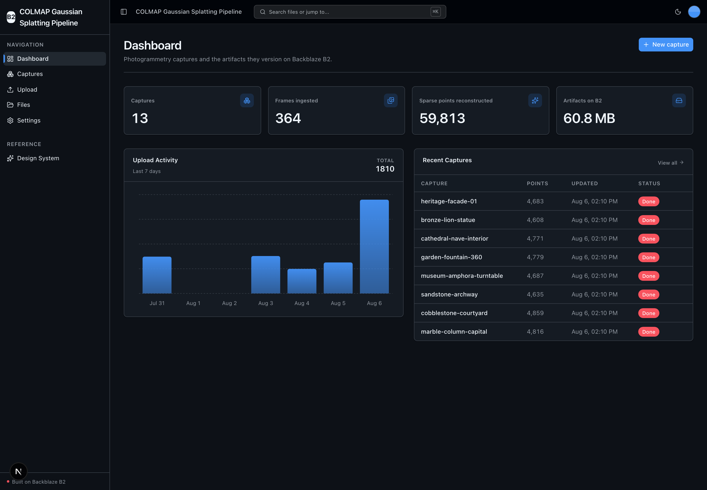
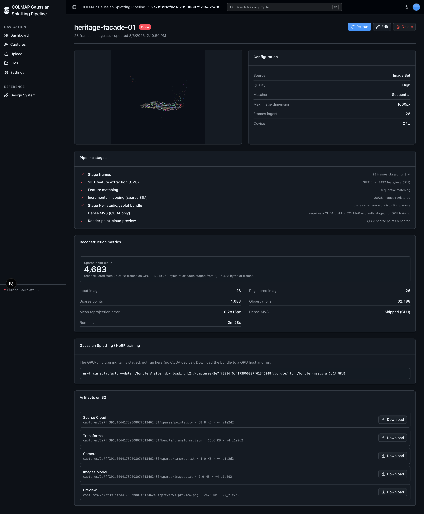

<!-- last_verified: 2026-08-06 -->
# COLMAP Gaussian Splatting Pipeline

An end-to-end, capture-to-B2 **photogrammetry pipeline**. Create a **Capture** from an image set or a capture video, run **COLMAP** structure-from-motion (`pycolmap`) on CPU to reconstruct a sparse point cloud + camera poses, then stage a **Nerfstudio / gsplat-ready bundle** (`transforms.json` + frames + sparse model + `points.ply`) for downstream 3D Gaussian Splatting / NeRF training. Every input and derived artifact is versioned under the capture's own prefix on **[Backblaze B2](https://www.backblaze.com/cloud-storage?utm_source=github&utm_medium=referral&utm_campaign=ai_artifacts&utm_content=b2ai-colmap-gaussian-splatting-pipeline)** over the S3-compatible API. Runs on local OSS only — COLMAP is keyless; the only secret is your B2 credentials.

Explore the official [Backblaze B2 AI integrations and sample applications](https://www.backblaze.com/cloud-storage/b2-ai-integrations?utm_source=github&utm_medium=referral&utm_campaign=ai_artifacts&utm_content=b2ai-colmap-gaussian-splatting-pipeline) directory and the checked-in [local OpenAPI contract](docs/api/openapi.json).

**What you get out of the box:**
- Full-stack UI (Next.js 16 + React 19 + Tailwind v4 + shadcn/ui) with a Captures library, capture detail (stage timeline, sparse-cloud preview, artifacts), and a photogrammetry dashboard
- Real COLMAP SfM via `pycolmap` — SIFT extraction (CPU), matching, incremental mapping — run in an isolated worker process so a native crash can't wedge the API
- A Nerfstudio/gsplat bundle staged to B2 plus the exact `ns-train` command for the GPU-only training tail
- Full-bucket File Explorer and drag-and-drop Upload kept from the starter
- FastAPI backend with strict layered architecture and structural tests
- Agent-optimized docs — your AI coding agent can read the repo and start contributing immediately

## What it looks like

**Dashboard** — captures, frames ingested, sparse points reconstructed, and artifacts on B2:



**Capture detail** — sparse point-cloud preview, pipeline stages, reconstruction metrics, and versioned artifacts on B2:



## Quick Start

You need: Node.js >= 20, pnpm >= 9, Python >= 3.11, and a free **[Backblaze B2 account](https://www.backblaze.com/sign-up/ai-cloud-storage?utm_source=github&utm_medium=referral&utm_campaign=ai_artifacts&utm_content=b2ai-colmap-gaussian-splatting-pipeline)**. No GPU is required for the sparse reconstruction; dense MVS and splat training are CUDA-only and auto-gated.

### Supported local environments

Local scripts are supported on macOS, Linux, and WSL2. Native Windows is not
supported yet because the dev scripts use POSIX shell syntax and
`services/api/.venv/bin/*` paths; use WSL2 on Windows. COLMAP's compute runs
on-device, so the API must run somewhere that can install the `pycolmap` wheel
(the API is local/self-hosted — see [Deploying](#deploying)).

### Setup

**1. Run setup**

```bash
pnpm run setup
```

This copies `.env.example` to `.env` only when `.env` does not already exist,
installs workspace dependencies from `pnpm-lock.yaml`, creates
`services/api/.venv` if missing, and installs the API's committed Python
resolution from `services/api/requirements.lock` (including `pycolmap`,
`numpy`, `matplotlib`, and `imageio` + the bundled ffmpeg). It is safe to rerun
and never overwrites an existing `.env`.

> Use the `pnpm run` form: `setup` (like `doctor`) is a built-in pnpm command
> before pnpm 11, so bare `pnpm setup` would run pnpm's own command instead of
> this script.

**2. Add your B2 credentials**

Open `.env` and set the standardized `B2_*` variables from the
[Backblaze B2 dashboard](https://secure.backblaze.com/b2_buckets.htm?utm_source=github&utm_medium=referral&utm_campaign=ai_artifacts&utm_content=b2ai-colmap-gaussian-splatting-pipeline):

1. **Create a bucket** → paste its unique name into `B2_BUCKET_NAME`, and set
   `B2_REGION` to the bucket's region (e.g. `us-east-005`). The S3 endpoint is
   derived from the region automatically.
2. **Create an application key** with `Read and Write` permission:
   - **keyID** → `B2_APPLICATION_KEY_ID`
   - **applicationKey** → `B2_APPLICATION_KEY` *(only shown once — paste it now)*

Enable **object versioning** on the bucket to see every input/output version
surfaced per artifact (the app degrades gracefully if versioning is off).

> Walkthroughs: [creating a bucket](https://www.backblaze.com/docs/cloud-storage-create-and-manage-buckets?utm_source=github&utm_medium=referral&utm_campaign=ai_artifacts&utm_content=b2ai-colmap-gaussian-splatting-pipeline) and [creating app keys](https://www.backblaze.com/docs/cloud-storage-create-and-manage-app-keys?utm_source=github&utm_medium=referral&utm_campaign=ai_artifacts&utm_content=b2ai-colmap-gaussian-splatting-pipeline).

**3. Run it**

```bash
pnpm dev
```

Frontend at `localhost:3000`, API at `localhost:8000`. Interactive API docs
(Swagger UI) at `localhost:8000/docs`, ReDoc at `/redoc`. `pnpm dev` runs the
preflight `pnpm run doctor` first to catch common setup gotchas.

**4. (Optional) Seed a demo capture**

```bash
services/api/.venv/bin/python services/api/scripts/seed_demo.py
```

Paints a feature-rich synthetic multi-view set, uploads it as one capture under
its own `captures/` prefix, and runs a real CPU reconstruction — handy for
screenshots and a first end-to-end check. Idempotent and prefix-scoped; not run
by `pnpm verify`.

## How it works — the capture lifecycle

1. **Create a Capture** (`/captures/new`): name it and choose the source
   (image set or capture video), a quality preset, a matcher, and a max image
   dimension. A capture is a JSON manifest in B2 — there is no database.
2. **Ingest frames** on the capture detail page: upload overlapping photos, or
   upload a video the server samples into frames (bundled ffmpeg). Frames are
   downscaled and stored under `captures/<id>/inputs/`.
3. **Run** COLMAP SfM: SIFT feature extraction (CPU) → matching → incremental
   mapping → sparse point cloud + camera intrinsics/extrinsics. The heavy
   compute runs in an isolated worker process so a native crash/hang is
   contained. Dense MVS is attempted only on a CUDA host (auto-gated).
4. **Stage the bundle**: `transforms.json`, the registered frames, the sparse
   COLMAP model, and `points.ply` are written to `captures/<id>/bundle/` and
   `captures/<id>/sparse/`, plus a matplotlib preview PNG. On a CPU host the app
   emits the exact `ns-train splatfacto` command to run the GPU-only training
   tail on the staged bundle — it never fakes a trained splat.

Everything — raw frames, SfM outputs, staged bundle, previews, and the manifest
— lives under the capture's own B2 prefix, accessed over the S3-compatible API
with a custom user agent and the standard `B2_*` env vars.

## When to use

Use this when you want a working, self-hostable photogrammetry pipeline that
turns photos or a short video into a sparse reconstruction and a ready-to-train
gsplat/NeRF bundle, with Backblaze B2 as the versioned storage layer for the
whole lifecycle. It complements standalone splat/NeRF reconstruction tools by
handling capture ingest, CPU SfM, and durable artifact storage.

## When not to use

Do not expect a hosted SaaS, GPU training out of the box, or a real-time
scanner. Gaussian-splat/NeRF *training* is GPU-only and staged here, not run on
the default CPU path. There are no user accounts, authentication, tenant
isolation, or billing — you own the product-specific security, operations,
capacity, and compliance decisions for anything you adapt to production.

## Core Features

- [Capture ingest](docs/features/capture-ingest.md) — image set or capture video → frames on B2
- [COLMAP structure-from-motion](docs/features/sfm-reconstruction.md) — real `pycolmap` SfM on CPU (the primary entity: **Capture**)
- [Splat / NeRF staging](docs/features/splat-staging.md) — Nerfstudio/gsplat bundle + the exact `ns-train` command
- [Point-cloud preview](docs/features/point-cloud-preview.md) — headless matplotlib render of the sparse cloud
- [Versioned artifact store on B2](docs/features/capture-storage.md) — per-capture prefix, object versions, presigned downloads
- [Captures library + dashboard](docs/features/captures-dashboard.md) — scoped explorer + domain metrics
- [File Upload](docs/features/file-upload.md) and [File Browser](docs/features/file-browser.md) — kept starter scaffolding (raw-frame ingest + full-bucket explorer)
- [Design System](docs/design-system.md) — tokens, primitives, loader, error/empty states. Live preview at `/design`.

Backend niceties kept from the starter: single-source `.env` validated at
startup, centralized TanStack Query data layer, a checked local API contract
(`pnpm contract:check`), structural tests, structured JSON logging, `/health`
and `/metrics`, per-IP rate limiting, and magic-byte upload validation
(see [SECURITY.md](docs/SECURITY.md)).

## Tech Stack

- TypeScript, Next.js 16, React 19, Tailwind v4, shadcn/ui, Recharts, TanStack Query
- Python 3.11+, FastAPI, boto3, Pydantic v2
- COLMAP via `pycolmap`, `numpy`, `matplotlib` (headless preview), `imageio` + `imageio-ffmpeg` (video frames) — all lazy-imported in `repo/`
- Backblaze B2 (S3-compatible object storage)
- pnpm workspaces (monorepo)

## Commands

| Command | What it does |
|---------|-------------|
| `pnpm run setup` | Idempotently copy `.env.example` to `.env` if missing, install workspace + locked API dependencies, create the venv |
| `pnpm run doctor` | Preflight environment check (also runs automatically before `pnpm dev`) |
| `pnpm dev` | Start frontend + backend |
| `pnpm dev:web` | Frontend only |
| `pnpm dev:api` | Backend only |
| `pnpm contract:export` | Export deterministic FastAPI OpenAPI JSON to `docs/api/openapi.json` |
| `pnpm contract:check` | Verify the checked-in OpenAPI artifact and frontend API client route registry |
| `pnpm check:agent-docs` | Validate agent shims, command docs, CI claims, and `.env` ignore coverage |
| `pnpm verify` | Credential-free canonical non-live pre-PR suite — runs `check:agent-docs`, `verify:api`, then `verify:web` |
| `pnpm verify:api` | Backend half: API lint, API tests, structure tests |
| `pnpm verify:web` | Frontend half: web lint, web unit tests, web typecheck + build |
| `pnpm verify:full` | `pnpm run doctor`, then `pnpm verify`, then Playwright E2E |
| `pnpm build` | Build frontend |
| `pnpm lint` / `pnpm lint:api` | Lint frontend / backend (ruff) |
| `pnpm test:web` / `pnpm test:api` | Frontend (vitest) / backend (pytest) tests |
| `pnpm check:structure` | Verify layering rules |
| `pnpm test:e2e` | Playwright E2E smoke tests |
| `services/api/.venv/bin/python services/api/scripts/seed_demo.py` | Optional: seed a synthetic demo capture and run a real CPU reconstruction |

`pnpm verify` needs neither B2 credentials, a GPU, nor a browser — heavy SfM
tests are skipped when `pycolmap` is absent. Run it before opening a PR; it
needs `services/api/.venv` from setup. See
[docs/dev-workflows.md](docs/dev-workflows.md) for the Python dependency-update
workflow and the verification details.

## Deploying

COLMAP runs native C++/CUDA kernels and long-running jobs, so the **API is
local/self-hosted** (Docker/Railway/a VM with the `pycolmap` wheel installed).
The Next.js frontend can deploy to Vercel pointing at the self-hosted API.

The one-click button below deploys the repo to Vercel as a single project (web
at `/`, API under `/api`) for a quick look at the UI and the file/dashboard
surface. Note: Vercel Functions cannot run COLMAP reconstruction (native
binaries, long jobs, 4.5 MB payload cap), so point captures at a self-hosted API
for real runs.

[](https://vercel.com/new/clone?repository-url=https%3A%2F%2Fgithub.com%2Fbackblaze-b2-samples%2Fcolmap-gaussian-splatting-pipeline&project-name=colmap-gaussian-splatting-pipeline&env=B2_APPLICATION_KEY_ID,B2_APPLICATION_KEY,B2_REGION,B2_BUCKET_NAME,MAX_FILE_SIZE&envDescription=B2%20credentials%2C%20region%2C%20bucket%2C%20and%20the%204MB%20Vercel%20upload%20cap&envLink=https%3A%2F%2Fgithub.com%2Fbackblaze-b2-samples%2Fcolmap-gaussian-splatting-pipeline%2Fblob%2Fmain%2Finfra%2Fvercel%2FREADME.md)

Set the B2 credentials, `B2_REGION`, bucket, and `MAX_FILE_SIZE=4000000`. The
web app reaches the API at the same-origin `/api` automatically, so no
`NEXT_PUBLIC_API_URL` is needed. Full variable classification, the
two-Projects alternative, security controls, and rollback are in the
[Vercel delivery contract](infra/vercel/README.md). Deploying is a
human-approved action — nothing here performs one for you.

## Documentation Map

| Doc | Purpose |
|-----|---------|
| [AGENTS.md](AGENTS.md) | Agent table of contents — start here |
| [ARCHITECTURE.md](ARCHITECTURE.md) | System layout, layering, reconstruction engine, data flows |
| [docs/features/](docs/features/) | Feature docs (capture ingest, SfM, splat staging, preview, storage, dashboard) |
| [docs/app-workflows.md](docs/app-workflows.md) | User journeys |
| [docs/dev-workflows.md](docs/dev-workflows.md) | Engineering workflows, testing, Python dependency updates |
| [docs/SECURITY.md](docs/SECURITY.md) | Security principles |
| [docs/RELIABILITY.md](docs/RELIABILITY.md) | Reliability expectations |
| [docs/api/openapi.json](docs/api/openapi.json) | Checked contract for the local FastAPI API |
| [infra/vercel/README.md](infra/vercel/README.md) | Vercel deployment contract |

## FAQ

**What is this?**
A self-hostable photogrammetry pipeline: capture → COLMAP structure-from-motion
→ a Nerfstudio/gsplat-ready bundle, with Backblaze B2 as the versioned storage
layer for every input and artifact. The primary entity is a **Capture**.

**Do I need a GPU?**
No — the marquee sparse SfM runs on CPU. The device is auto-detected (CUDA →
else CPU; MPS is N/A to COLMAP). Dense MVS and gsplat/NeRF *training* are
CUDA-only: on a CPU host the app stages the bundle and emits the exact
`ns-train` command to run on a GPU instead of faking a result.

**Is it free / does it need a second API key?**
Yes, and no. COLMAP is keyless open source; the only secret is your Backblaze B2
credentials. The code is MIT-licensed and B2 offers a free account.

**Where do the reconstruction outputs go?**
Under the capture's own B2 prefix: `captures/<id>/inputs/` (frames),
`captures/<id>/sparse/` (COLMAP model + `points.ply`), `captures/<id>/bundle/`
(`transforms.json` + registered frames), and `captures/<id>/previews/`. The
manifest is `captures/<id>/manifest.json`.

**Can I use it in production?**
It's a Backblaze sample. Production use requires your own validation — you own
security, operations, capacity, and compliance. No SLA covers the repository
software. See [When not to use](#when-not-to-use).

**Do I have to use Backblaze B2?**
It integrates B2 through the S3-compatible API and is built around it. Supply
your own bucket and application key during setup.

**Is it really built for AI coding agents?**
Yes. [AGENTS.md](AGENTS.md) is the single source of truth, architectural
boundaries are enforced by structural tests and lints, and the docs use
progressive disclosure.

**Does it work on Windows?**
Local scripts are supported on macOS, Linux, and WSL2 — use WSL2 on Windows.

**Where do I get help or report bugs?**
[GitHub Issues](https://github.com/backblaze-b2-samples/colmap-gaussian-splatting-pipeline/issues)
for repository defects; [Backblaze Support](https://www.backblaze.com/help?utm_source=github&utm_medium=referral&utm_campaign=ai_artifacts&utm_content=b2ai-colmap-gaussian-splatting-pipeline) for
B2 account, billing, service, or API help.

## Maintenance and support

Backblaze maintains this open-source sample to help developers get started with
B2. Production use is possible with caution and requires your own validation.
Report repository defects and feature requests through
[GitHub Issues](https://github.com/backblaze-b2-samples/colmap-gaussian-splatting-pipeline/issues);
for B2 account, billing, service, or API help, use
[Backblaze Support](https://www.backblaze.com/help?utm_source=github&utm_medium=referral&utm_campaign=ai_artifacts&utm_content=b2ai-colmap-gaussian-splatting-pipeline). This sample is not covered
by the Backblaze service level agreement, and no SLA is provided for the
repository software; any B2 service or support commitments are governed
separately by the applicable Backblaze terms and support plan.

## Contributing

Start with [AGENTS.md](AGENTS.md). It's the map — everything else is
discoverable from there. For local commit hooks, follow
[the pre-commit workflow](docs/dev-workflows.md#pre-commit).

## License

MIT License - see [LICENSE](LICENSE) for details.
